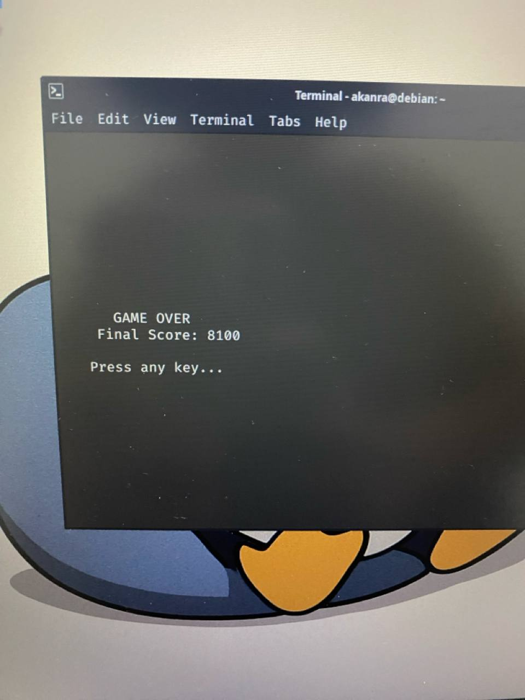

# 🐧 Tetris CLI

A simple Tetris game built with Python + curses.

## Features
- Color-coded pieces (7 warna beda tiap bentuk)
- Scoring system + level progression
- Increasing speed tiap level
- Hard drop (spasi)
- Arrow key + WASD support
- Game over screen

## Controls

| Tombol | Fungsi |
|--------|--------|
| ← / A / a | Move left |
| → / D / d | Move right |
| ↓ / S / s | Move down |
| ↑ / W / w | Rotate |
| **Spasi** | **Hard drop** (drop langsung) |
| Q / q / ESC | Quit |

## Requirements
Python 3 + curses (Linux)

## Demo

